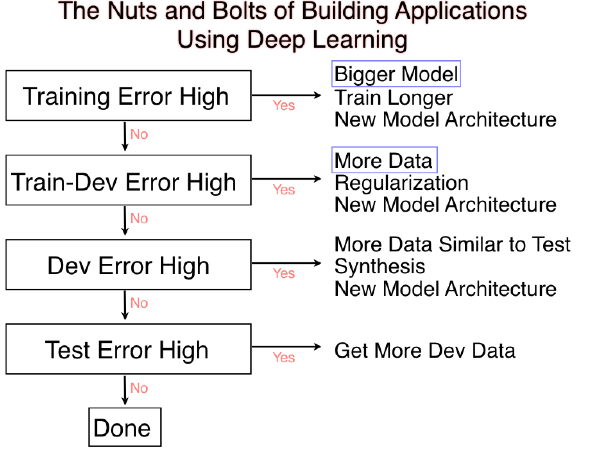
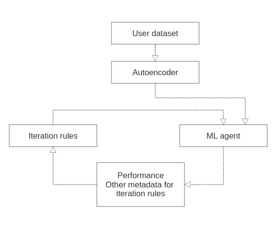

# Idea:

Inspired by the course "Introduction to ML stategy" from Andrew Ng. The idea is to gather all the advices into one knowledge base and then use them to make reasoning for next best iteration. I want it to be a framework which will be used for model iteration.

Automating the process of applying machine learning end-to-end additionally offers the advantages of producing simpler solutions, faster creation of those solutions, and models that often outperform hand-designed models.

Common techniques used in AutoML include **hyperparameter optimization**, **meta-learning** and **neural architecture search**.

Machine learning stages:
    - data pre-processing
    - feature engineering
    - feature extraction
    - feature selection
    - algorithm selection
    - hyperparameter optimization 

Each of these steps may be challenging, resulting in significant hurdles to using machine learning. AutoML aims to simplify these steps for non-experts, and make the practice of machine learning more efficient.

The most **difficult task** to automate is data cleaning because 'anything' is possible in the raw data and its format.

# Data preparation reasoning:
    - Column type detection; e.g., boolean, discrete numerical, continuous numerical, or text
    - Column intent detection; e.g., target/label, stratification field, numerical feature, categorical text feature, or free text feature
    - Task detection; e.g., binary classification, regression, clustering, or 
    ranking

# Feature engineering reasoning:
    - Feature selection
    - Feature extraction
    - Meta learning and transfer learning
    - Detection and handling of skewed data and/or missing values

- Ensembling - a form of consensus where using multiple models often gives better results than any single model

- Hyperparameter optimization of the learning algorithm and featurization

- Pipeline selection under time, memory, and complexity constraints
Selection of evaluation metrics and validation procedures

- Problem checking

- Leakage detection

- Misconfiguration detection

- Analysis of obtained results

- Creating user interfaces and visualizations

# Functionality:

- [ ] Keep track of progress
- [ ] Keep track of metrics
- [ ] Set up optimizing and satisficing metrics
- [ ] Split dataset (train/train-dev/dev/test sets)
- [ ] Error analysis
- [ ] Detect variance/bias/data mismatch
- [ ] Suggest best strategy

# Rules:

- [ ] Implement basic recipe for Neural Networks (because for classical ML algorithms "variance/bias tradeoff" works differently, for example, RF can be used to reduce variance without affecting bias)

    Rules:

    - IF high bias THEN train bigger network
    - IF high bias THEN train longer
    - IF high bias THEN try different NN architecture

    - IF high variance THEN need more data
    - IF high variance THEN need regularization
    - IF high variance THEN try different NN architecture

- [ ] Detect variance/bias...

    Rules:
    
    - IF human level error << training error THEN high avoidable bias
    - IF trainig error << training-dev error THEN high variance
    - IF training-dev error << or >>  dev set error THEN data mismatch
    - IF test set error >> dev set error THEN overfitting to dev set

- [ ] Detect errors

    Rules:

    - IF dev/test sets have data mismatch THEN error: "dev and test sets cannot have different distributions"

# Diagrams:

